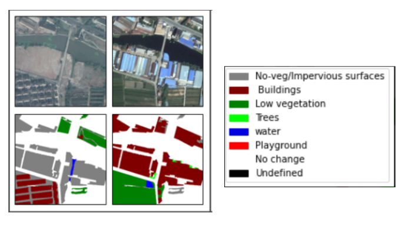

# Pragyan
**Team : Byteme**

Category: **Climate Change**

Problem Statement: Change detection in a time-series of Remote Sensing Images.

This repository contains a PyTorch implementation of a Fully Convolutional Network for semantic
segmentation and change detection of aerial images. More specifically, we aim to automatically
perform scene interpretation of images taken from a plane or a satellite by classifying every pixel
into several land cover classes. We are using the Deeplabv3 architecture to segment aerial images
over the cities of Hangzhou, Chengdu, and Shanghai. The images are from the SEmantic Change
detectiON Dataset( SEmantic Change detectiON Dataset(SECOND). Each image has size 512 x 512
and is annotated at the pixel level.  We have trained a network to segment the images into the
classes : buildings, low vegetation, trees, water, Playground, Impervious surfaces and No change. Our model has achieved overall accuracy of 95%

Dataset: https://drive.google.com/file/d/1QlAdzrHpfBIOZ6SK78yHF2i1u6tikmBc/view

Given time-series tiles of remote sensing images (2 dates), we aim to satisfy the following objectives
1. Identify areas of change and no change
2. Highlight the changes in Image 1 with respect to Image 2
3. Highlight the changes in Image 2 with respect to Image 1
4. Categorize the extracted changes with understandable labels
A system that satisfies these objectives will display inputs and outputs like the image shown below.  

The RS Image and it's segmentation on the left are from an earlier date and the images on the right are from a later date. 

This allows us to view the scene changes that have occured  periodically.

We attempted to create a web application from Google colab notebook by using a cross-platform application called ngrok to create secure URL to the localhost server but couldn’t achieve the same owing to the time constraints.
We have added the widgets and the corresponding outputs in a folder called Sample_Outputs

To test sample images with our pre-trained model, download the Input images directory, and modify
the paths accordingly in the Test Jupyter Notebook.
